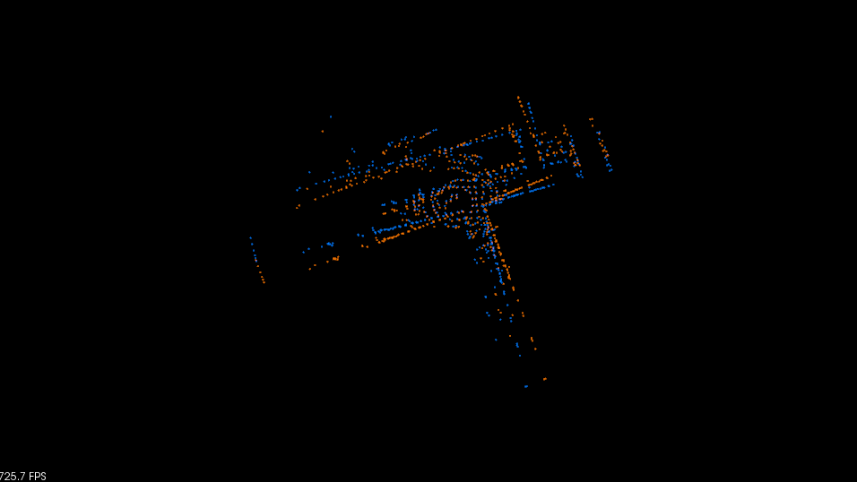
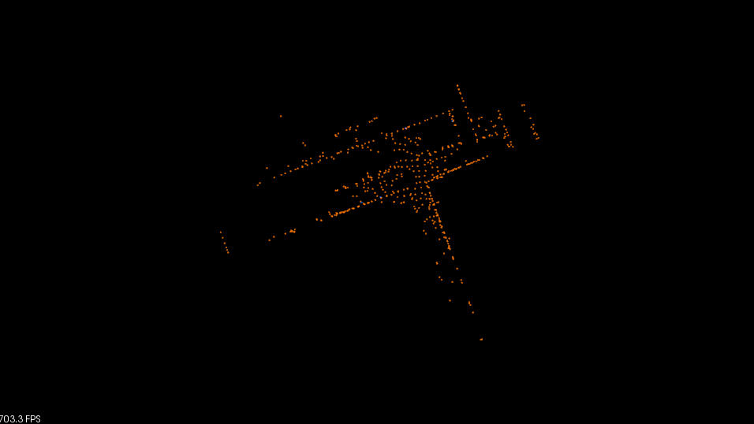

# ICP-Solver
## ICP-Solver
使用CERES库进行icp匹配

GICP：支持自动求导。

G2O：用多种方法实现了普通ICP。实现了GICP。效果较好。

Point-to-Point ICP：支持解析求导和自动求导。通过yaml中的is_autoDiff选择。

支持Debug输出每次运行时间，支持设置ceres使用多线程。

## Dependencies

**Ubuntu**

Ubuntu 64-bit 18.04.

**Ceres Solver**

Follow [Ceres Installation](http://ceres-solver.org/installation.html).

**PCL**

Follow [PCL Installation](http://www.pointclouds.org/downloads/linux.html).

**yaml-cpp**

Follow [yaml-cpp](https://github.com/jbeder/yaml-cpp)


## Results
**CERES**
|  original pointCloud   | pointCloud after GICP  |
|  ----  | ----  |
|   |  |

**G2O**

|  original pointCloud   | pointCloud after GICP  |
|  ----  | ----  |
|   |  |

**Output:**
```
**Ceres Output: **
===========START CERES ICP TEST !===========
cloud_source points size: 554
auto Diff, i: 0, using time: 构造用时: 0.0264362s解算用时: 0.0469408s总共用时: 0.0733769s
auto Diff, i: 1, using time: 构造用时: 0.026907s解算用时: 0.0726214s总共用时: 0.0995284s
auto Diff, i: 2, using time: 构造用时: 0.0273164s解算用时: 0.102846s总共用时: 0.130162s
auto Diff, i: 3, using time: 构造用时: 0.0285628s解算用时: 0.291242s总共用时: 0.319805s
auto Diff, i: 4, using time: 构造用时: 0.0285555s解算用时: 0.326351s总共用时: 0.354906s
    0.999998 -0.000945755  -0.00146787  0.000936642
 0.000945109     0.999999 -0.000440995   -0.0201661
  0.00146829  0.000439608     0.999999    -0.016365
           0            0            0            1
```


## TODO
- [ ] add gtsam method.
- [X] add g2o method.
- [X] Plane-to-Plane ICP.(GICP)。(使用llt()分解似乎效果还不如直接相乘。)
- [X] GICP是否可以避免每次都要重新计算协方差，直接利用旋转矩阵在上一次基础上更新。($cov' = R*cov*R^T$,   $U' = R*U$)
- [ ] Using nanoFLANN to speed up.
- [ ] Is there any way to optimize the way when creating a ceres solver.

## Acknowledgements
Thanks for [testICP](https://github.com/chengwei0427/testICP), 
[ALOAM](https://github.com/HKUST-Aerial-Robotics/A-LOAM),
[gicp](https://github.com/avsegal/gicp) 
and 
[ceres blog](https://blog.csdn.net/qq_42911741/article/details/127326164)